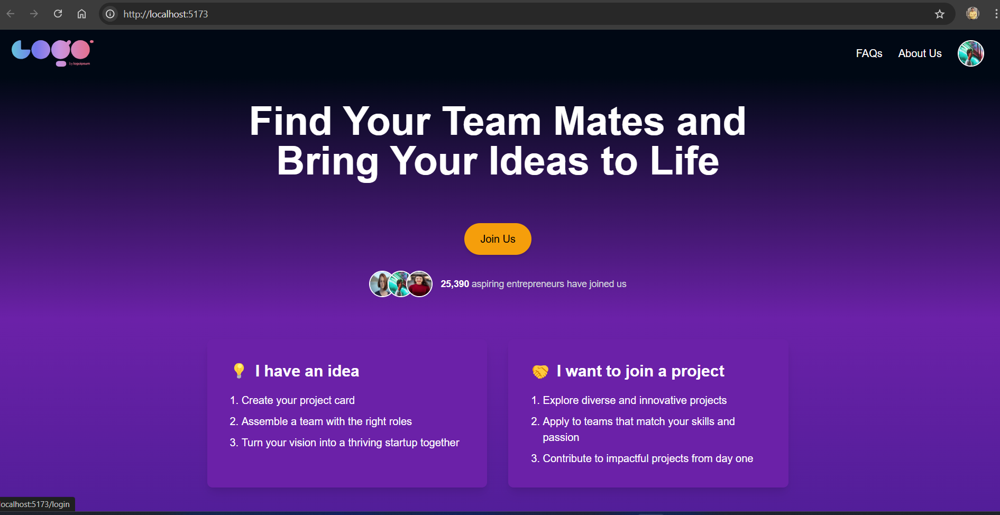
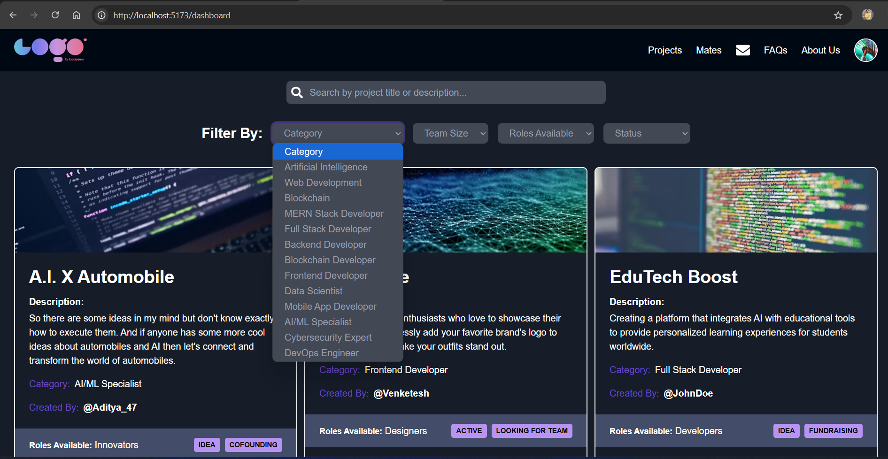
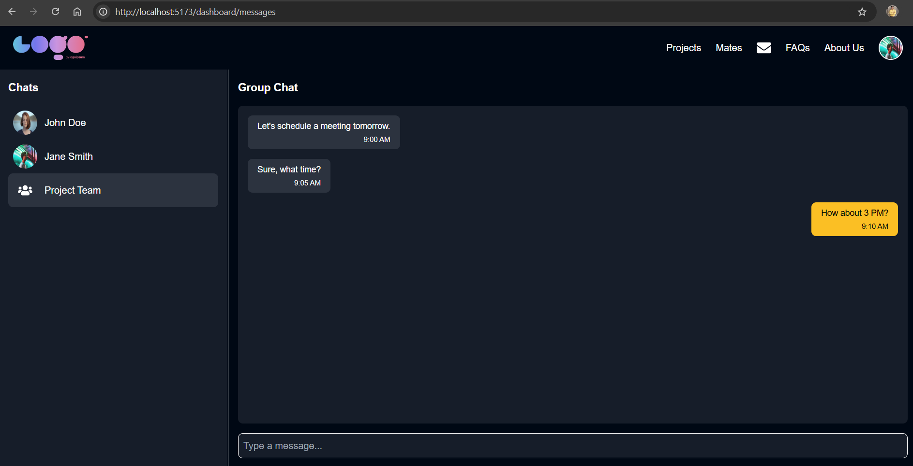
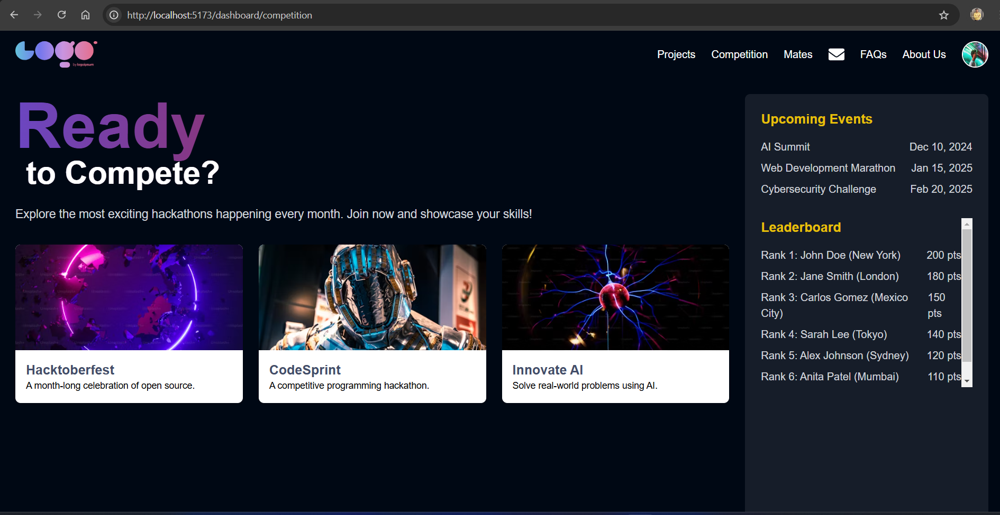
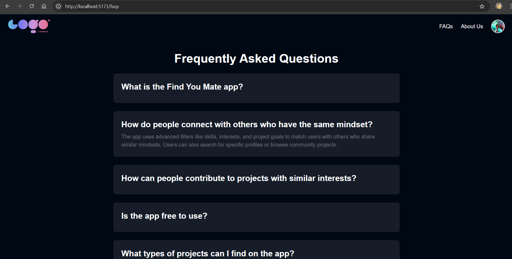
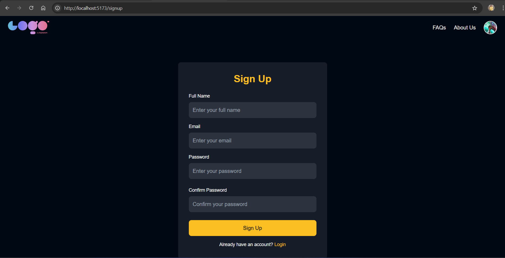

# CollabConnect Prototype

**Live Link**: [CollabConnect Prototype](https://collab-connect-wheat.vercel.app/)

**CollabConnect** is a centralized platform built to connect individuals with shared interests and skills, enabling seamless project collaboration and networking. Designed for students, startups, freelancers, and hobbyists, the platform provides tools for brainstorming, team-building, and project management.

---

## 🔥 Features

### Key Features
- **Interest-Based Matching**: Connect with users sharing similar project interests.
- **Skill Discovery**: Highlight and discover skills for effective team-building.
- **Project Dashboard**: Manage tasks, timelines, and milestones efficiently.
- **Communication Tools**: Integrated chat, video calls, and forums for collaboration.
- **Community Events**: Participate in hackathons, webinars, and networking events.
- **Leaderboard**: Compete and showcase achievements in community challenges.
- **Privacy Controls**: Manage visibility and control over connections.

---

## 🛠️ Tech Stack

- **Frontend**: React.js, Vite, Tailwind CSS
- **Backend**: Node.js, Express.js
- **Database**: MongoDB
- **Authentication**: JWT for secure user authentication
- **APIs**: REST APIs, WebSockets for real-time features

---

## 📸 Screenshots

### Landing Page
  
*The landing page offers a welcoming UI with clear navigation and a prominent call-to-action for users to sign up or log in. Users can instantly understand the platform's value proposition, highlighting collaboration opportunities and innovative features.*

---

### Dashboard
  
*The dashboard provides an intuitive overview of active projects, tasks, and team activities. Key features include timeline tracking, milestone progress, and seamless access to communication tools. It serves as a one-stop hub for efficient project management.*

---

### Messages Page
  
*The messages page facilitates real-time communication with integrated chat options. Users can interact with team members, share ideas, and keep project discussions organized in one place.*

---

### Competition Page
  
*The competition page displays an engaging leaderboard with rankings and progress in various challenges. Users can join competitions, showcase their skills, and earn rewards for their achievements.*

---

### FAQs Page
  
*The FAQs page addresses common user queries, providing quick and helpful responses. It enhances user experience by reducing friction during onboarding and usage.*

---

### Signup Page
  
*The signup page offers a simple and user-friendly form for new users to create an account. It ensures a smooth onboarding process with clear instructions and a modern design.*

---

## 🎯 Target Audience

- **Students and Researchers**: Collaborate on academic and research projects.
- **Startups and Entrepreneurs**: Build teams for innovative solutions.
- **Freelancers**: Discover and participate in creative projects.
- **Hobbyists**: Work on passion projects with like-minded individuals.

---

## 💪 Competitive Advantages

- **Personalized Matching Algorithms**: Ensures the right connections.
- **End-to-End Collaboration Tools**: From brainstorming to execution.
- **Community Support**: Leverage shared expertise and mentorship.

---

## 🚀 Getting Started

Follow these steps to set up the project locally:

1. **Clone the Repository**
   ```bash
   git clone https://github.com/username/collabconnect.git

2. cd collab-connect
3. npm install
4. npm run dev